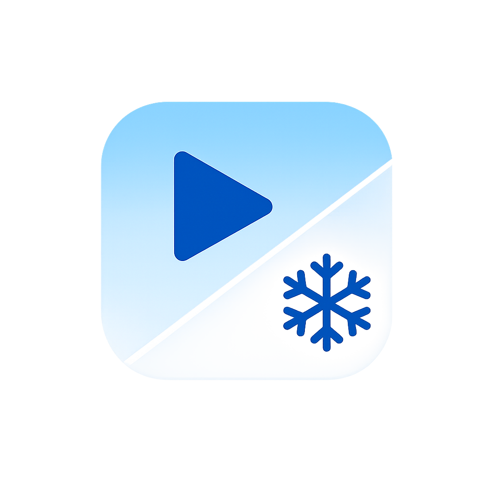

# rfvp: A Non-Official Rust cross-platform implementation of the FVP engine

### Status
* Bootable, But still WIP
* See [setsusme](setsumei/README.md) for details.

### rfvp debug HUD
* Enable it with F2 hotkey (Fn + F2 on MacOS)

### HOW TO BUILD
* macOS Bundle: [setsumei/HOW-TO-BUILD.macos-bundle.md](setsumei/HOW-TO-BUILD.macos-bundle.md)
* iOS IPA: [setsumei/HOW-TO-BUILD.ios.md](setsumei/HOW-TO-BUILD.ios.md)
* Android APK: [setsumei/HOW-TO-BUILD.android-apk.md](setsumei/HOW-TO-BUILD.android-apk.md)
* Windows EXE: [setsumei/HOW-TO-BUILD.windows-msvc.md](setsumei/HOW-TO-BUILD.windows-msvc.md)
* Linux ELF: [setsumei/HOW-TO-BUILD.host.md](setsumei/HOW-TO-BUILD.host.md)

### Supported Platforms and Packaging Types
| Platform | Packaging Type(s) Supported                                | Launcher | Standalone Executable | Architectures                       |
| -------- | ---------------------------------------------------------- | -------: | --------------------: | ----------------------------------- |
| macOS    | App Bundle (`.app`), DMG (`.dmg`)                          |      Yes |                    No | arm64 (Apple Silicon)               |
| iOS      | IPA (`.ipa`, AltStore flow), XCFramework-based app wrapper |      Yes |                    No | arm64 (device), arm64 (simulator)   |
| Android  | APK (`.apk`)                                               |      Yes |                    No | arm64-v8a, x86_64                   |
| Windows  | Standalone EXE                                             |       No |                   Yes | x86_64, arm64                       |
| Linux    | Standalone (planned)                                       |       No |         Yes (planned) | x86_64 (planned), aarch64 (planned) |

### Compatibility
This project aims to be compatible with all versions of the original FVP engine. 
Ensuring 100% compatibility requires testing against all related games. If you find this project useful and want to help speed up the compatibility testing process for more games, please consider sponsoring the project.

* Also see [setsumei/COMPATIBILITY.md](setsumei/COMPATIBILITY.md) for details. Some features and behaviors may differ from the original engine.

### Disclaimer
This project is a standalone, reverse-engineered reimplementation of the original game engine logic. All source code has been written from scratch based on research and observation of the target software's behavior. This repository contains no original source code from the original developers.

### License
This project is licensed under the MPL-2.0 License. See the [LICENSE](LICENSE) file for details.
