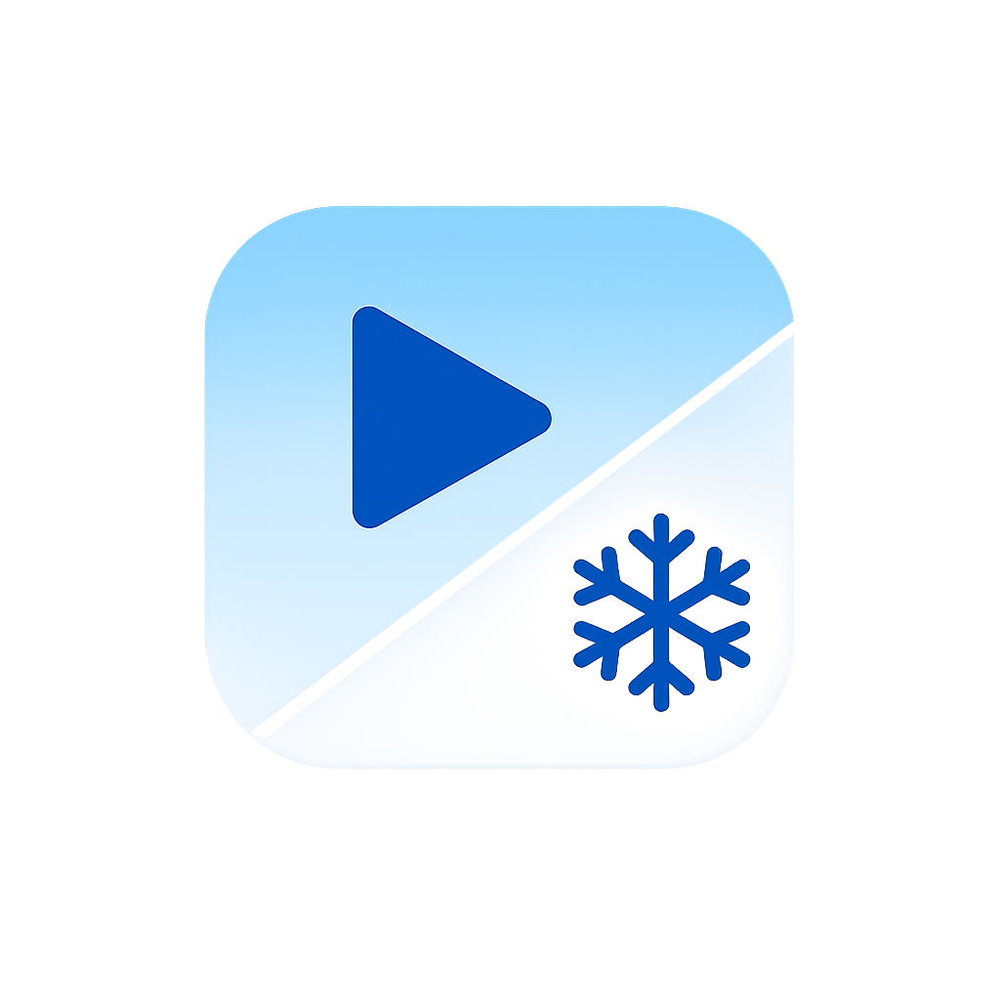
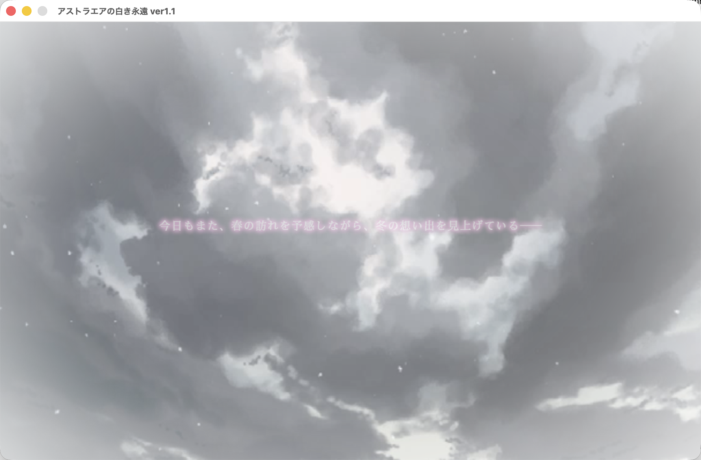

# rfvp: A Non-Official Rust cross-platform implementation of the FVP engine

### Status
* Playable?
* See [setsusmei](setsumei/README.md) for details.

### rfvp debug HUD
* Enable it with F2 hotkey (Fn + F2 on MacOS)

### HOW TO BUILD
* macOS Bundle: [setsumei/HOW-TO-BUILD.macos-bundle.md](setsumei/HOW-TO-BUILD.macos-bundle.md)
* iOS IPA: [setsumei/HOW-TO-BUILD.ios.md](setsumei/HOW-TO-BUILD.ios.md)
* Android APK: [setsumei/HOW-TO-BUILD.android-apk.md](setsumei/HOW-TO-BUILD.android-apk.md)
* Windows EXE: [setsumei/HOW-TO-BUILD.windows-msvc.md](setsumei/HOW-TO-BUILD.windows-msvc.md)
* Linux ELF: [setsumei/HOW-TO-BUILD.host.md](setsumei/HOW-TO-BUILD.host.md)

### Installation

RFVP provides platform-specific installation guides under [`setsumei/installation`](setsumei/installation):

- [Windows](setsumei/installation/Windows.md)
- [Linux](setsumei/installation/Linux.md)
- [macOS](setsumei/installation/macOS.md)
- [iOS](setsumei/installation/iOS.md)
- [Android](setsumei/installation/Android.md)

### Documentation

The Rust API documentation for this project is available here:

- [RFVP Rust API Docs](https://xmoezzz.github.io/rfvp/)

### Supported Platforms and Packaging Types
| Platform | Packaging Type(s) Supported                                | Launcher | Standalone Executable | Architectures                       |
| -------- | ---------------------------------------------------------- | -------: | --------------------: | ----------------------------------- |
| macOS    | App Bundle (`.app`) and DMG (`.dmg`)                          |      Yes |                    No | Universal       |
| iOS      | Unsigned IPA (`.ipa`, AltStore) |      Yes |                    No | arm64   |
| Android  | APK (`.apk`)                                               |      Yes |                    No | arm64-v8a, x86_64                   |
| Windows  | Standalone EXE                                             |       No |                   Yes | x86_64, arm64                       |
| Linux    | Standalone (planned)                                       |       No |                   Yes | x86_64, aarch64 (planned) |

* Since this is a Rust project, it should be possible to build for many other platforms as well. 
* I personally using macOS for development, currently no Windows script is provided. Pull requests are welcome.

### Compatibility
This project aims to be compatible with all versions of the original FVP engine. 
Ensuring 100% compatibility requires testing against all related games. If you find this project useful and want to help speed up the compatibility testing process for more games, please consider sponsoring the project.

* Also see [setsumei/COMPATIBILITY.md](setsumei/COMPATIBILITY.md) for details. Some features and behaviors may differ from the original engine.

### Disclaimer
- This project is a standalone, reverse-engineered reimplementation of the original game engine logic. All source code has been written from scratch based on research and observation of the target software's behavior. This repository contains no original source code from the original developers.
- You must own a legitimate copy of the original game to use this engine. You are strictly prohibited from distributing, sharing, or providing download links for any original game data, assets, or bundled game executables.
- The original game company and rights holders retain all ownership of their intellectual property. As a courtesy, the original company is free to utilize the code within this repository for any purpose, including commercial use, without prior permission.

### License
This project is licensed under the MPL-2.0 License. See the [LICENSE](LICENSE) file for details.
