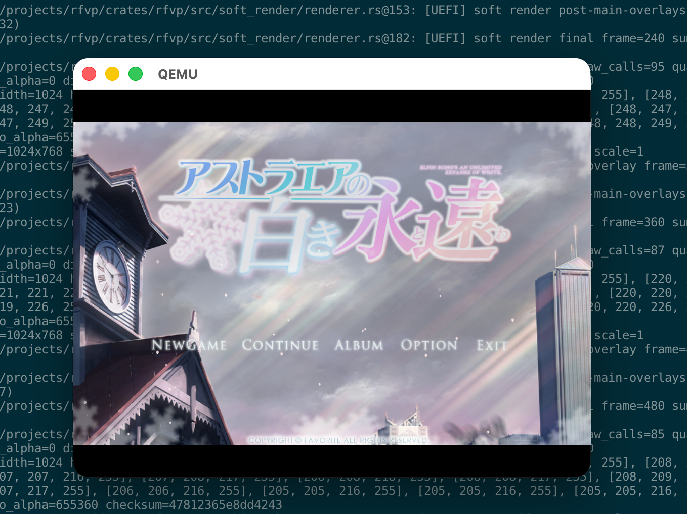

# rfvp: A Non-Official Rust cross-platform implementation of the FVP engine and IDE.

  <a href="README.md">English</a> |
  <a href="README.ja.md">日本語</a> |
  <a href="README.zh-Hant.md">繁體中文</a> |
  <a href="README.zh-Hans.md">简体中文</a>

### What is rfvp?
* See [setsusmei](setsumei/README.md) for details.

* You can even use rfvp as an **Operation System**! Turn on your computer and boot with the UEFI program.

### rfvp debug HUD
* Enable it with F2 hotkey (Fn + F2 on MacOS)
* Only desktop platforms (Windows, Linux, macOS) for now.

### Pre-built Binaries
Pre-built binaries for supported platforms are available in the [Pre-built Binaries](https://github.com/xmoezzz/rfvp/releases/tag/pre-release)

* Please note that pre-release version is the latest version containing the most recent features and fixes. 
* I usually don't bump the version so ofter. So if you want to get the latest features and fixes, please check the pre-release version.

### Custom Font
* By default, the engine uses a built-in font that is compatible with all original games. However, you can also use a custom font by put a ttf file in the `fonts` directory under the game data directory. 

### Translated Version
If you want to run a translated game, currently we only support UTF-8 and GBK encodings. You should switch to the proper encoding through `Nls` before running the game. However, only switching encoding doesn't guarantee that the translated game will work in following cases (not limited to):
* The translated strings are not stored in the `*.hcb` file.
* The translated game encrypts the translated assets.
* Any other ways that the translated game differs from the original game in terms of data structure and format.

### HOW TO BUILD
* macOS Bundle: [setsumei/HOW-TO-BUILD.macos-bundle.md](setsumei/HOW-TO-BUILD.macos-bundle.md)
* iOS IPA: [setsumei/HOW-TO-BUILD.ios.md](setsumei/HOW-TO-BUILD.ios.md)
* Android APK: [setsumei/HOW-TO-BUILD.android-apk.md](setsumei/HOW-TO-BUILD.android-apk.md)
* Windows EXE: [setsumei/HOW-TO-BUILD.windows-msvc.md](setsumei/HOW-TO-BUILD.windows-msvc.md)
* Linux ELF: [setsumei/HOW-TO-BUILD.host.md](setsumei/HOW-TO-BUILD.host.md)

### Beyond Reimplementation
* Since we have both decompiler and compiler, we can also write an application based on the engine, such as a simple Windows-95-style painter.

### Installation

RFVP provides platform-specific installation guides under [`setsumei/installation`](setsumei/installation):

- [Windows](setsumei/installation/Windows.md)
- [Linux](setsumei/installation/Linux.md)
- [macOS](setsumei/installation/macOS.md)
- [iOS](setsumei/installation/iOS.md)
- [Android](setsumei/installation/Android.md)

### Documentation

The Rust API documentation for this project is available here:

- [RFVP Rust API Docs](https://xmoezzz.github.io/rfvp/)

### Supported Platforms and Packaging Types
| Platform | Packaging Type(s) Supported                                | Launcher | Standalone Executable | Architectures                       |
| -------- | ---------------------------------------------------------- | -------: | --------------------: | ----------------------------------- |
| macOS    | App Bundle (`.app`) and DMG (`.dmg`)                          |      Yes |                    No | Universal       |
| iOS      | Unsigned IPA (`.ipa`, AltStore) |      Yes |                    No | arm64   |
| Android  | APK (`.apk`)                                               |      Yes |                    No | arm64-v8a, x86_64                   |
| Windows  | Standalone EXE                                             |       No |                   Yes | x86_64, arm64                       |
| Linux    | Standalone                                                 |       No |                   Yes | x86_64, aarch64 |
| WASM     | Bundle                                            |      Yes |                    No | **Any architecture** (via WASI)          |
| FreeBSD  | Standalone                                                 |       No |                   Yes | x86_64 |
| UEFI     | Standalone EFI (`.efi`)                                             |       No |                   Yes | x86_64, arm64                       |
| PS Vita  | Standalone (`.eboot`)                                               |       No |                   Yes | armv7                   |
| PSP      | Standalone (`.eboot`)                                               |       No |                   Yes | MIPS R4000                 |
| PS3      | Static Library (`.a`)                                               |       No |                   Yes | PPC64BE                   |
| PS2      | Static Library (`.a`)                                               |       No |                   Yes | MIPS R5900                   |
| Switch    | Standalone (`.nro`)                                               |       No |                   Yes | arm64-v8a                   |
| Wii U      | Standalone (`.rpx`)                                               |       No |                   Yes | PowerPC 750CL                 |
| Wii      | Standalone (`.dol`)                                               |       No |                   Yes | PowerPC 750CL                  |
| 3DS      | Standalone (`.3dsx`)                                               |       No |                   Yes | arm6k                    |

* Since this is a Rust project, it should be possible to build for many other platforms as well.

### As Library
* Normal Mode: Provide full capabilities of the engine, including using `winit` for event handling and `wgpu` for rendering. This mode is suitable for modern platforms.
* Non-Standard Mode: Both event handling and rendering are handled by the target platform. This mode is suitable for modern game consoles and some embedded systems.
* Old-School Mode: We don't use `*.bin` package files at all. Glyphs must be pre-rendered into 16 x 16 4bpp tiles, and game data must be pre-processed by using `rfvp-rebuilder`. We do everything for reducing memory consumption. This mode is suitable for legacy game consoles with less than 128MB of memory available to the game process, while you need to implement plaform-specific code for rendering, audio, input handling, file I/O, etc. We set minimum memory requirement to 32MB as our goal.
* soft-renderer feature: By enabling the `soft-renderer` feature, you can use a built-in software renderer instead of `wgpu`, and everything just works on CPU. There is no more high-DPI support for this feature, so the game will be rendered exactly at its original resolution. If you believe that your niche platform haven't supported by `wgpu` yet, you can try this feature. It should work on any platform that Rust supports, while you don't need to write any line of code. This feature is not optimized for low memory budget.

### Compatibility
This project aims to be compatible with all versions of the original FVP engine. 
Ensuring 100% compatibility requires testing against all related games. If you find this project useful and want to help speed up the compatibility testing process for more games, please consider sponsoring the project.

* Also see [setsumei/COMPATIBILITY.md](setsumei/COMPATIBILITY.md) for details. Some features and behaviors may differ from the original engine.

### Disclaimer
- This project is a standalone, reverse-engineered reimplementation of the original game engine logic. All source code has been written from scratch based on research and observation of the target software's behavior. This repository contains no original source code from the original developers.
- You must own a legitimate copy of the original game to use this engine. You are strictly prohibited from distributing, sharing, or providing download links for any original game data, assets, or bundled game executables.
- The original game company and rights holders retain all ownership of their intellectual property. As a courtesy, the original company is free to utilize the code within this repository for any purpose, including commercial use, without prior permission.

### License
This project is licensed under the MPL-2.0 License. See the [LICENSE](LICENSE) file for details.
