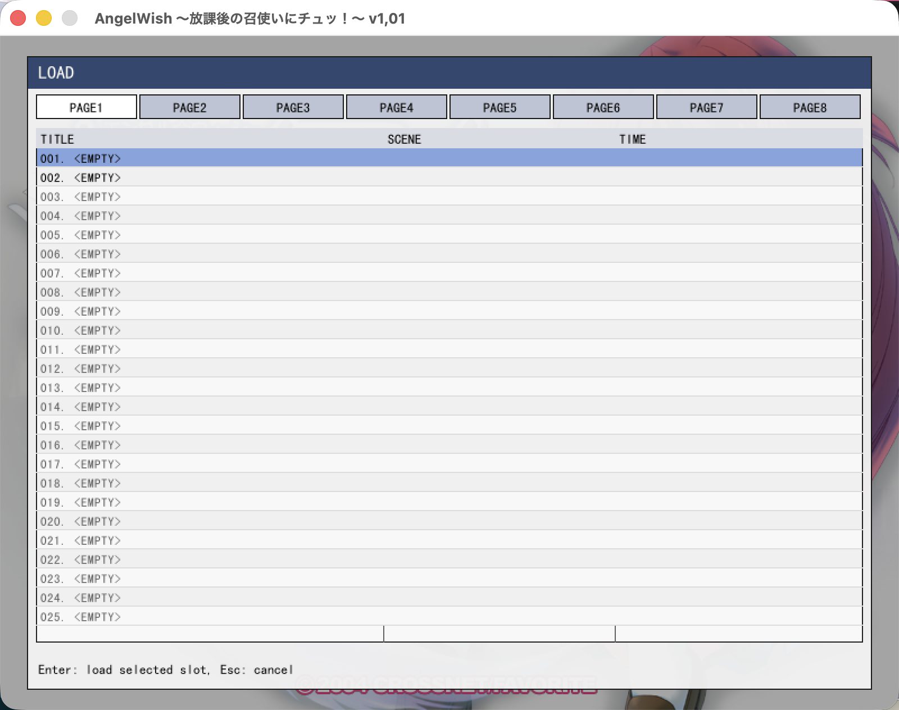
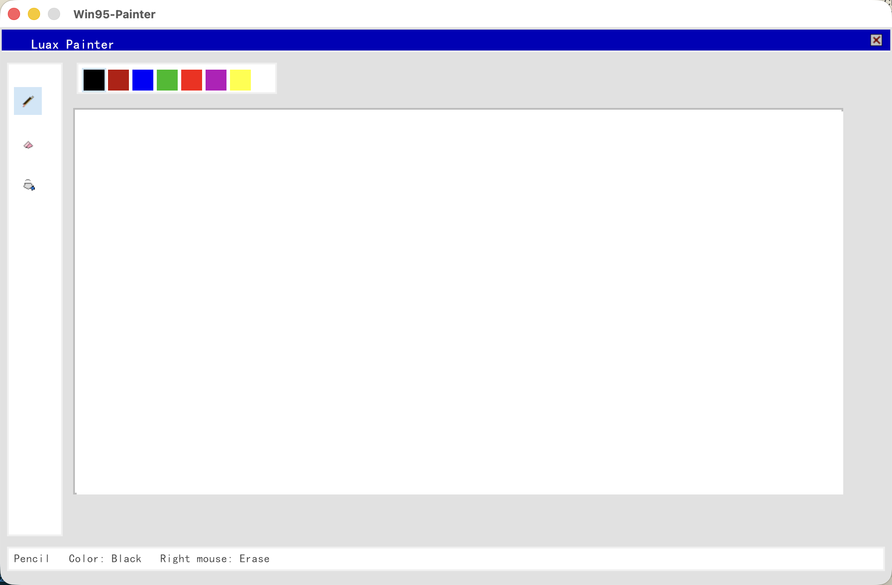

# rfvp: FVP 引擎與 IDE 的非官方 Rust 跨平台實現

  <a href="README.md">English</a> |
  <a href="README.ja.md">日本語</a> |
  <a href="README.zh-Hant.md">繁體中文</a> |
  <a href="README.zh-Hans.md">简体中文</a>

### 狀態
* 可遊玩？
* 詳情請參閱 [setsumei](setsumei/README.md)。

### rfvp 除錯 HUD
* 可透過 F2 熱鍵啟用（macOS 上為 Fn + F2）。

### 預先建置的二進位檔
支援平台的預先建置二進位檔可從 [Pre-built Binaries](https://github.com/xmoezzz/rfvp/releases/tag/pre-release) 取得。

* 請注意，pre-release 版本是包含最新功能與修正的最新版本。
* 我通常不會頻繁提升版本號。因此，如果你想取得最新功能與修正，請查看 pre-release 版本。

### 建置方式
* macOS Bundle: [setsumei/HOW-TO-BUILD.macos-bundle.md](setsumei/HOW-TO-BUILD.macos-bundle.md)
* iOS IPA: [setsumei/HOW-TO-BUILD.ios.md](setsumei/HOW-TO-BUILD.ios.md)
* Android APK: [setsumei/HOW-TO-BUILD.android-apk.md](setsumei/HOW-TO-BUILD.android-apk.md)
* Windows EXE: [setsumei/HOW-TO-BUILD.windows-msvc.md](setsumei/HOW-TO-BUILD.windows-msvc.md)
* Linux ELF: [setsumei/HOW-TO-BUILD.host.md](setsumei/HOW-TO-BUILD.host.md)

### 超越再實作
* 由於本專案同時具備反編譯器與編譯器，我們也可以基於此引擎編寫應用程式，例如一個簡單的 Windows 95 風格繪圖程式。

### 安裝

RFVP 在 [`setsumei/installation`](setsumei/installation) 下提供各平台的安裝指南：

- [Windows](setsumei/installation/Windows.md)
- [Linux](setsumei/installation/Linux.md)
- [macOS](setsumei/installation/macOS.md)
- [iOS](setsumei/installation/iOS.md)
- [Android](setsumei/installation/Android.md)

### 文件

本專案的 Rust API 文件可在此處取得：

- [RFVP Rust API Docs](https://xmoezzz.github.io/rfvp/)

### 支援平台與封裝類型
| 平台 | 支援的封裝類型                                           | 啟動器 | 獨立執行檔 | 架構                                  |
| ---- | ---------------------------------------------------------- | -----: | ---------: | ------------------------------------- |
| macOS | App Bundle (`.app`) 與 DMG (`.dmg`)                       |     是 |         否 | Universal                             |
| iOS | 未簽署 IPA (`.ipa`, AltStore)                              |     是 |         否 | arm64                                 |
| Android | APK (`.apk`)                                            |     是 |         否 | arm64-v8a, x86_64                     |
| Windows | 獨立 EXE                                               |     否 |         是 | x86_64, arm64                         |
| Linux | 獨立程式                                                |     否 |         是 | x86_64, aarch64                       |
| WASM | Bundle                                                    |     是 |         否 | **任意架構**（透過 WASI）             |

* 由於本專案是 Rust 專案，因此理論上也可以建置到許多其他平台。

### 相容性
本專案目標是相容於原始 FVP 引擎的所有版本。  
要確保 100% 相容，需要對所有相關遊戲進行測試。如果你覺得本專案有用，並希望協助加速更多遊戲的相容性測試流程，請考慮贊助本專案。

* 另請參閱 [setsumei/COMPATIBILITY.md](setsumei/COMPATIBILITY.md) 以取得詳細資訊。部分功能與行為可能與原始引擎不同。

### 免責聲明
- 本專案是針對原始遊戲引擎邏輯所做的獨立、逆向工程再實作。所有原始碼均基於對目標軟體行為的研究與觀察，從零開始撰寫。本儲存庫不包含原始開發者的任何原始碼。
- 使用本引擎必須擁有原始遊戲的合法副本。嚴禁散布、分享或提供任何原始遊戲資料、素材，或隨附遊戲執行檔的下載連結。
- 原始遊戲公司與權利持有人保留其智慧財產的所有權。出於善意，原始公司可將本儲存庫中的程式碼用於任何目的，包括商業用途，且無需事先取得許可。

### 授權
本專案採用 MPL-2.0 License 授權。詳情請參閱 [LICENSE](LICENSE) 檔案。
