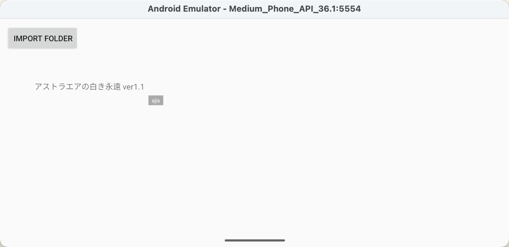
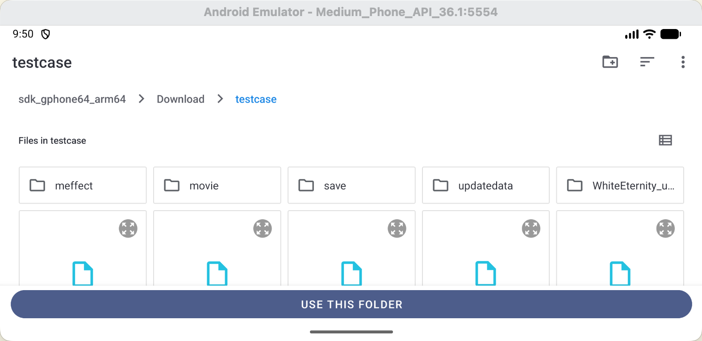
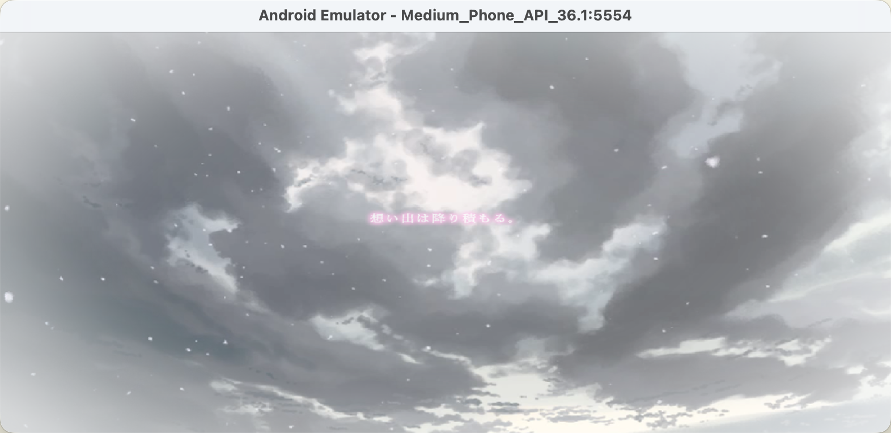

# Android Installation

On Android, RFVP is distributed as an APK.

This project is not distributed in bundle mode, so the APK does not include the original game data.

## What the CI builds

The current CI builds Android on `ubuntu-22.04`.

The current CI configuration builds with:

- Android platform: `28`
- Build tools: `34.0.0`
- NDK: `26.3.11579264`
- Variant: `debug`
- ABIs: `arm64-v8a`, `x86_64`

## Requirements

Before starting, make sure you have all of the following:

- An Android device
- A built APK, or the Android build environment if you want to build the project yourself
- The original game data files from your own installation

## Installation Overview

The Android workflow has three parts:

1. install the APK
2. copy the game folder to a location accessible from the Android file picker
3. import that folder in RFVP and start the game

## 1. Install the APK

Install the generated APK on your Android device using your normal Android installation workflow.

After installation, launch the app.

## 2. Copy the Game Folder

On Android, the game data should be copied as a normal folder, not bundled into the APK.

A practical location is a user-accessible directory such as `Download`. The example below shows a game folder named `testcase` under `Download`.

### Folder Selection



In the launcher, tap `IMPORT FOLDER`.



Then use the Android system file picker to select the game folder itself. In this example, the selected folder is:

```text
Download/testcase
```

The game folder should contain the original game files and subdirectories.

## Permission Notes

Android file access may depend on the system file picker and the permissions granted to the app.

If the folder cannot be selected, or the app cannot see the game files after selection, check the following:

- make sure the game was copied as a folder
- make sure you selected the game folder itself
- move the folder to a simpler user-accessible location
- grant the folder access when Android asks for permission
- avoid locations that are restricted by the system or hidden behind vendor-specific file manager behavior

## 3. Start the Game

After the folder is imported successfully, the launcher should list it as a playable entry.

## In Game

The following screenshot shows the game running on Android.




