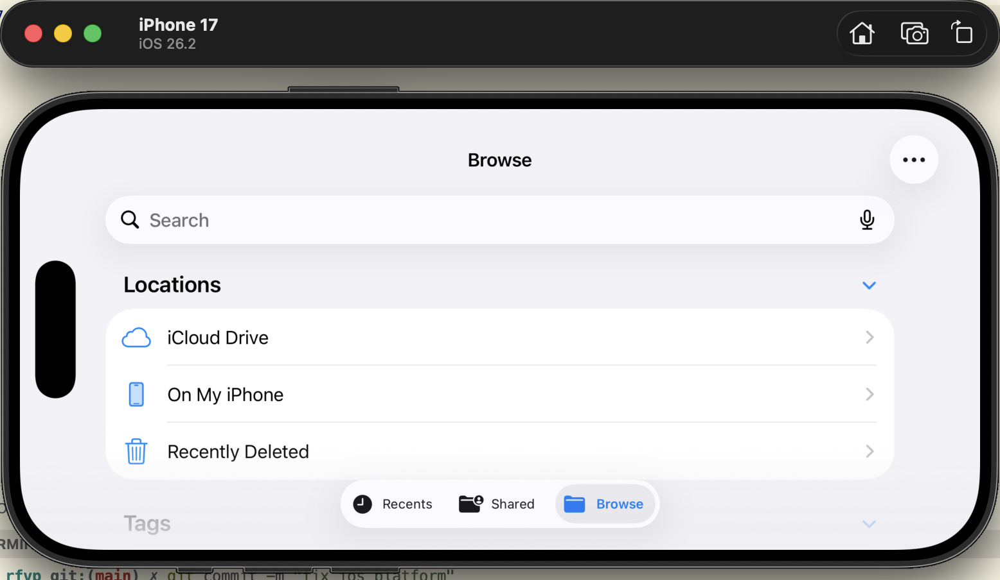
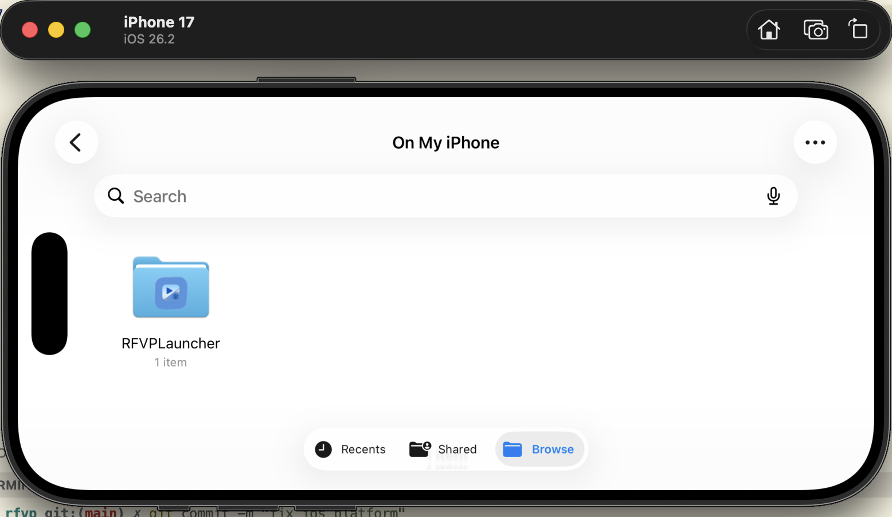
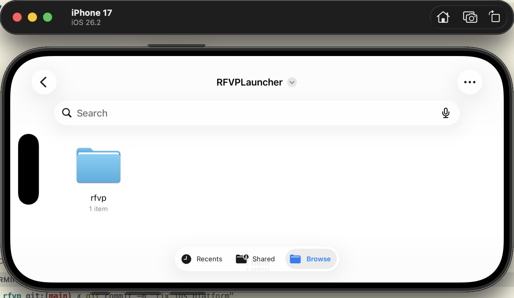
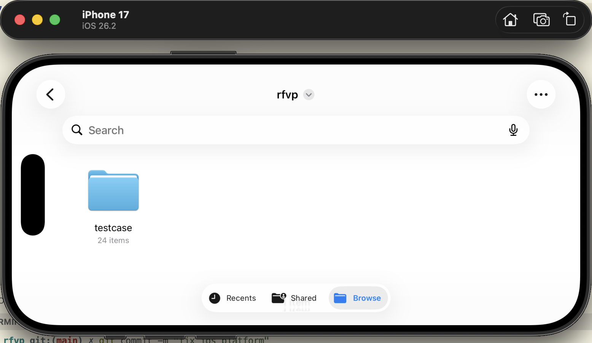
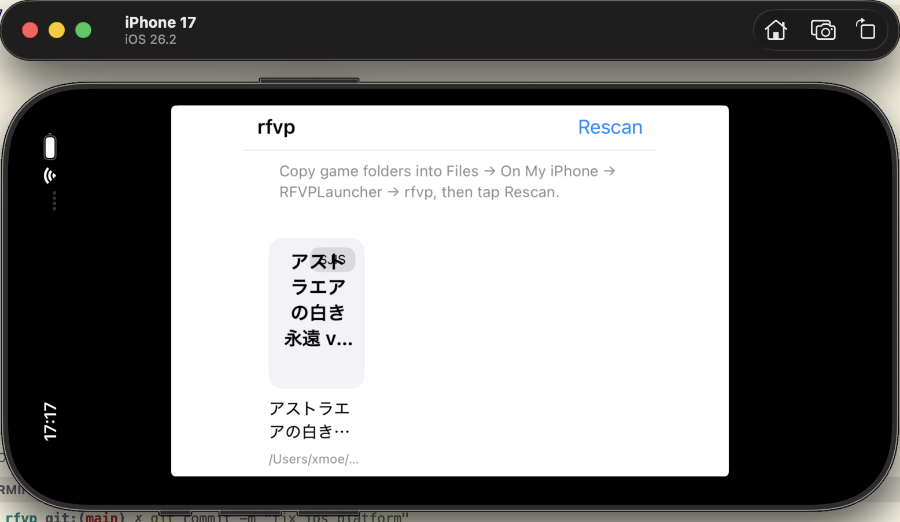
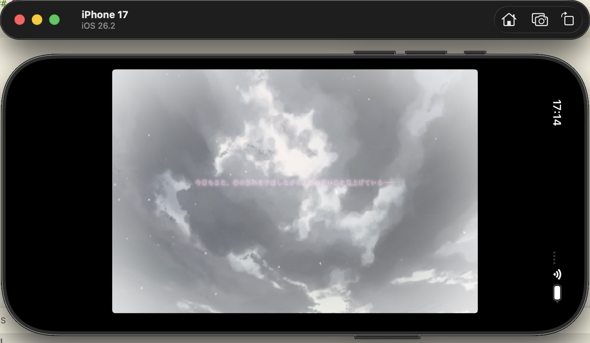
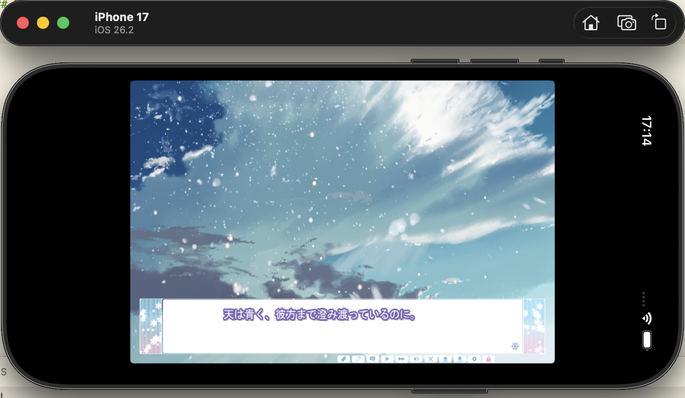
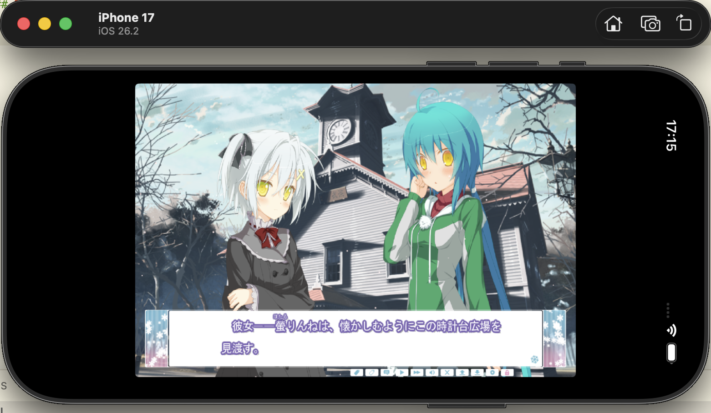

# iOS Installation

On iOS, RFVP is distributed as an unsigned `.ipa`.

This means you need to sign and install the app yourself using your own iOS sideloading workflow.

## What the CI builds

The current CI builds iOS on `macos-15` and produces:

- an unsigned `.ipa`
- an `xcframework` build artifact

The current packaging path in CI uses:

```bash
./platform/scripts/build_ios_xcframework.sh
./platform/scripts/package_ios_altstore_ipa.sh
```

## Installation Overview

The iOS workflow has three parts:

1. install the unsigned app on your device using your own signing method (like AltServer)
2. copy the game files into the app's document area
3. rescan in the launcher and start the game

## 1. Install the App

Because the distributed `.ipa` is unsigned, you must sign it yourself before installing it on a real device.

After installation, launch the app once so that its document directory is created in the Files app.

## 2. Copy Game Files

RFVP on iOS expects the game files to be copied through the Files app.

The screenshots below show the expected path:

- `Files`
- `On My iPhone`
- `RFVPLauncher`
- `rfvp`
- your game folder

### Files App Path



Open the Files app and go to `On My iPhone`.



Enter the `RFVPLauncher` directory.



Inside it, open the `rfvp` directory.



Copy your game folder there. In this example, the game folder is `testcase`.

## 3. Use the Launcher

After the game files have been copied, open RFVP and rescan the library.

The launcher UI will detect game folders under the app storage path and list them as playable entries.



In the launcher, tap `Rescan` if the copied game does not appear immediately.

## In Game

The following screenshots show RFVP running the game on iOS.







## Notes

- The current CI produces an unsigned `.ipa`, so installation on a real device requires your own signing workflow.
