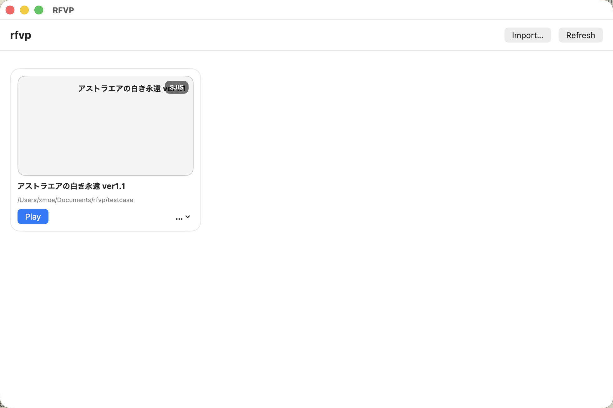

# macOS Installation

macOS currently supports two distribution modes:

- bundle mode, recommended
- non-bundle mode, mainly for development

Bundle mode is the best way to distribute the project on macOS. The macOS build is already a universal binary, so it can be distributed directly as a `.dmg`.

## Mode 1: Bundle Mode

Bundle mode uses the packaged macOS application bundle.

### Bundle Mode UI

Use the launcher to import a game directory and start the game.



In bundle mode, RFVP provides a native launcher UI for managing and launching games directly from the application.

- At the top of the window, it provides an `Import...` button for adding a game directory. The launcher **only record the game path instead of copying the game files**. 
- The `Refresh` button for reloading the current list. 
- The `Play` button for launching it. 
- Once a game was launched, we can't go back to the launcher UI. 

This is the recommended macOS user experience. Instead of manually preparing a working directory and starting the executable from the command line.

### Code Signing

If you are using a build that you did not compile yourself, you should sign it yourself before running it.

The examples below assume the app has already been placed in `/Applications/RFVP.app`.

```bash
sudo codesign --force --deep --sign - /Applications/RFVP.app
```
- The is code sign is only valid for the current user and will not be recognized by Gatekeeper on other machines. If you want to distribute the app to other users, you need to sign it with a valid Apple Developer ID certificate. In this case, you should follow the official Apple documentation on code signing and notarization.
- sudo is required, and you may be prompted for your password. 


## Mode 2: Non-Bundle Mode

Non-bundle mode is mainly intended for development or manual setup.


### Requirements

Before starting, make sure you have all of the following:

- a supported macOS system (It depends on the current Rust toolchain support, but generally macOS 10.15 or later should work).
- the original game data files from your own installation.
- either a prebuilt non-bundle binary, or the Rust toolchain if you want to build the project yourself.

### Directory Layout

Create a folder for the game and place the files in a layout like this:

```text
<GameRoot>/
  rfvp
  <game data files or directories>
```

### Running in Non-Bundle Mode

1. Place `rfvp` in your game directory.
2. Copy the original game data files into the same directory, or into the subdirectory expected by the game.
3. Make the executable runnable:

```bash
chmod +x rfvp
```

4. Launch the game:

```bash
./rfvp
```
